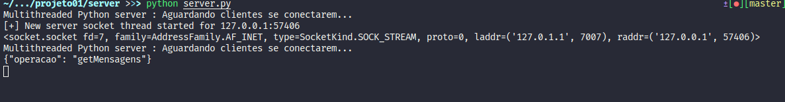
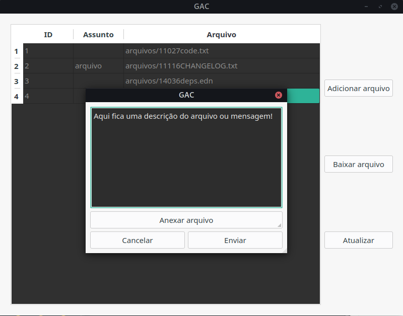
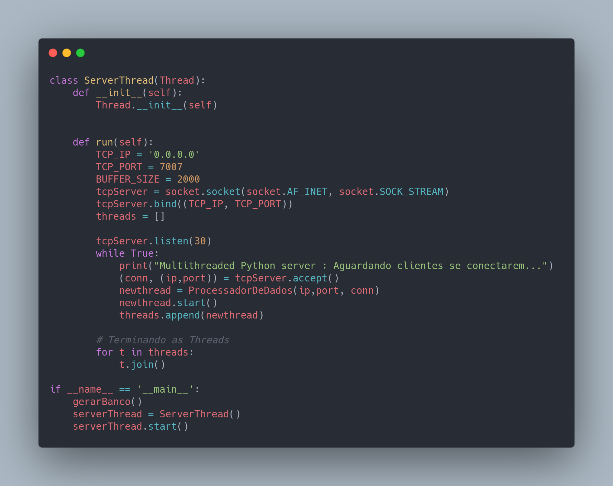
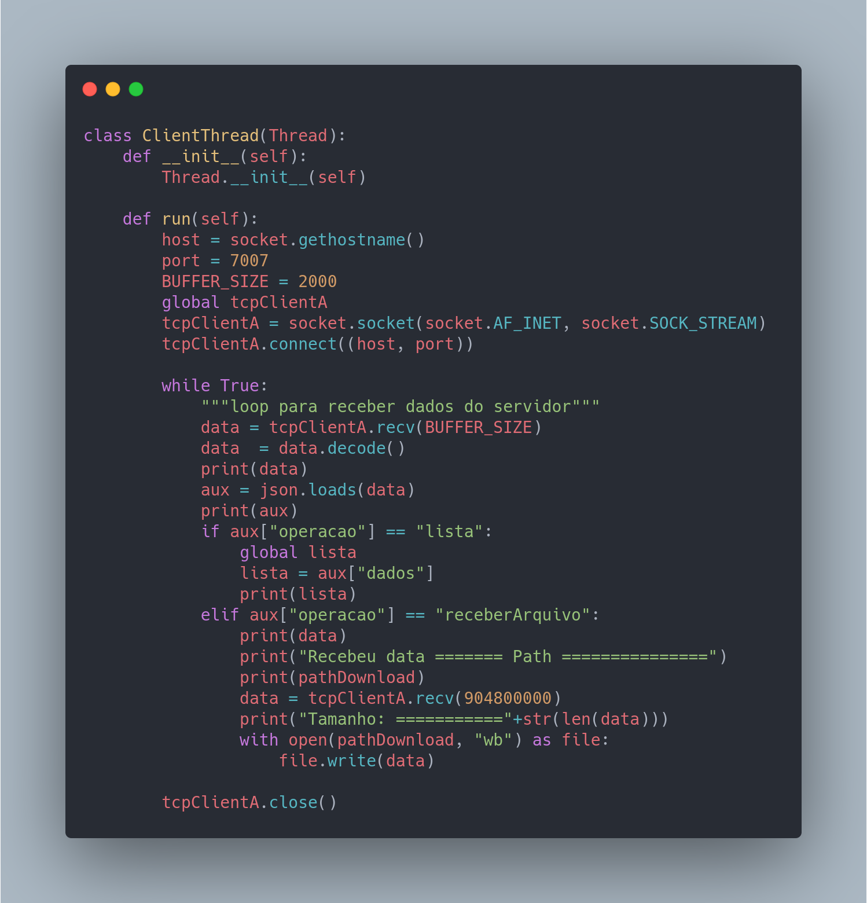

# Projeto 01 - Sistemas Distribuídos 

> Desenvolver uma aplicação cliente/servidor usando sockets ou JAVA RMI. O link compartilhado tem algumas sugestões de projetos. Alguns deles podem ser feitos com Computação Paralela (com asterisco).O projeto tem que ter implementações explícitas da chamada remota. Não utilizem APIs que abstraem estas funções.

<br>

## Projeto: GAC - Gerenciador de Arquivos Compartilhados

**Objetivo**: Programa para enviar arquivos para um servidor disponibilizando-os para outros usuários (**clientes**).
O servidor armazena os arquivos junto com descrição/mensagem e os **clientes** conseguem visualizar e baixar.

### Requisitos para executar:

* Python 3.x
* Biblioteca pyqt5 

```console
@myuser$: pip install PyQt5
```

### Instruções para executar a aplicação:

No diretorio :file_folder: [server](server) executar o arquivo como segue: 

```console
@myuser$: python server.py
```
No diretorio :file_folder: [client](client) executar o arquivo como segue: 

```console
@myuser$: python client.py
```
<br>

### Capturas de tela

<br>

#### Lado servidor: 
<p align = 'center'>
    
</p>

<br>

#### Lado do cliente
<p align = 'center'>
    
</p>

<br>

### Backend da aplicação (servidor):

<p align = 'center'>
    
</p>

### Front-end da aplicação (cliente)

<p align = 'center'>
    
</p>

#### Observações importantes:
> Os trechos de código acima expõe como cliente e servidor se conectam através dos sockets. Os demais detalhes da implementação estão nos respectivos diretórios. Para a comunicação (troca de mensagens) utilizou-se de dicionário de dados com os respectivos comandos (um protoco próprio)