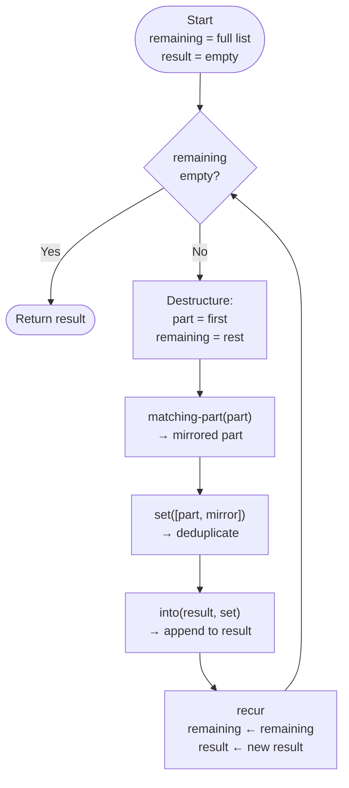

# Understanding `symmetrize-body-parts`

## The Full Function

```clojure
(defn symmetrize-body-parts
  [asym-body-parts]
  (loop [remaining-asym-parts asym-body-parts
         final-body-parts []]
    (if (empty? remaining-asym-parts)
      final-body-parts
      (let [[part & remaining] remaining-asym-parts]
        (recur remaining
               (into final-body-parts
                     (set [part (matching-part part)])))))))
```

---

## Key Concepts

### 1. `loop` — Setting Up Variables

`loop` works like `let`: it declares named bindings with initial values.
These bindings are the **loop variables** — they get updated on every iteration.

```clojure
(loop [remaining-asym-parts asym-body-parts ; full list to process
       final-body-parts []]                 ; empty result to accumulate into
  ...)
```

---

### 2. Destructuring — `[part & remaining]`

Inside `let`, the `[]` on the left is a **destructuring pattern** applied to `remaining-asym-parts`.

```clojure
(let [[part & remaining] remaining-asym-parts]
;;    ^^^^^^^^^^^^^^^^^  ^^^^^^^^^^^^^^^^^^
;;    destructure this   from this value
```

Given `remaining-asym-parts = [{:name "left-eye"} {:name "head"}]`:

| Binding     | Value                  |
|-------------|------------------------|
| `part`      | `{:name "left-eye"}`   |
| `remaining` | `({:name "head"})`     |

The `&` means "everything else" — same idea as rest args in a function.

---

### 3. `into` + `set` — Building the Result

```clojure
(into final-body-parts
      (set [part (matching-part part)]))
```

Evaluated **inside-out**:

1. `(matching-part part)` → generates the mirrored part (`left-eye` → `right-eye`)
2. `(set [part (matching-part part)])` → creates a set with both — **deduplicates** (important for parts like `head` that have no mirror)
3. `(into final-body-parts ...)` → appends the set into the accumulated result

**Example:**

| Input part    | `matching-part` result | `set` result                             |
|---------------|------------------------|------------------------------------------|
| `left-eye`    | `right-eye`            | `#{left-eye, right-eye}` (2 items)       |
| `head`        | `head`                 | `#{head}` (1 item, deduped)              |

---

### 4. `recur` — Looping Back

`recur` jumps back to the top of `loop`, passing **new values** for its bindings.

```clojure
(recur remaining                      ; remaining-asym-parts ← rest of list
       (into final-body-parts ...))   ; final-body-parts   ← updated result
```

It repeats until `(empty? remaining-asym-parts)` is true, then returns `final-body-parts`.

> `recur` is Clojure's way of doing tail-recursive loops **without stack overflow**.

---

### 5. Evaluation Order — Inside-Out

In Clojure, **arguments are evaluated before the function is called**.
The innermost expression runs first:

```
(recur remaining
       (into final-body-parts
             (set [part (matching-part part)])))

Order:
  1. (matching-part part)               → mirrored part
  2. (set [part <result-1>])            → set with both
  3. (into final-body-parts <result-2>) → new accumulated list
  4. recur is called with results
```

---

## Flow Diagram



---

## Traced Example

Input: `[{:name "left-eye" :size 1} {:name "head" :size 3}]`

### Iteration 1
```
remaining = [{:name "left-eye"} {:name "head"}]
result  = []

part      = {:name "left-eye"}
remaining = [{:name "head"}]
set       = #{{:name "left-eye"} {:name "right-eye"}}
result    = [{:name "left-eye"} {:name "right-eye"}]
```

### Iteration 2
```
remaining = [{:name "head"}]
result  = [{:name "left-eye"} {:name "right-eye"}]

part      = {:name "head"}
remaining = []
set       = #{{:name "head"}}   ← deduped!
result    = [{:name "left-eye"} {:name "right-eye"} {:name "head"}]
```

### Iteration 3
```
remaining = []  ← empty!
→ return result: [{:name "left-eye"} {:name "right-eye"} {:name "head"}]
```

---

## Summary

> *"Take one part at a time, add it and its mirror to the result, repeat until done."*

| Concept        | Role                                         |
|----------------|----------------------------------------------|
| `loop`         | Sets up loop variables with initial values   |
| `[a & b]`      | Destructures first element and the rest      |
| `matching-part`| Generates the mirrored body part             |
| `set`          | Deduplicates (handles parts with no mirror)  |
| `into`         | Appends items into the accumulated result    |
| `recur`        | Jumps back to `loop` with updated values     |
