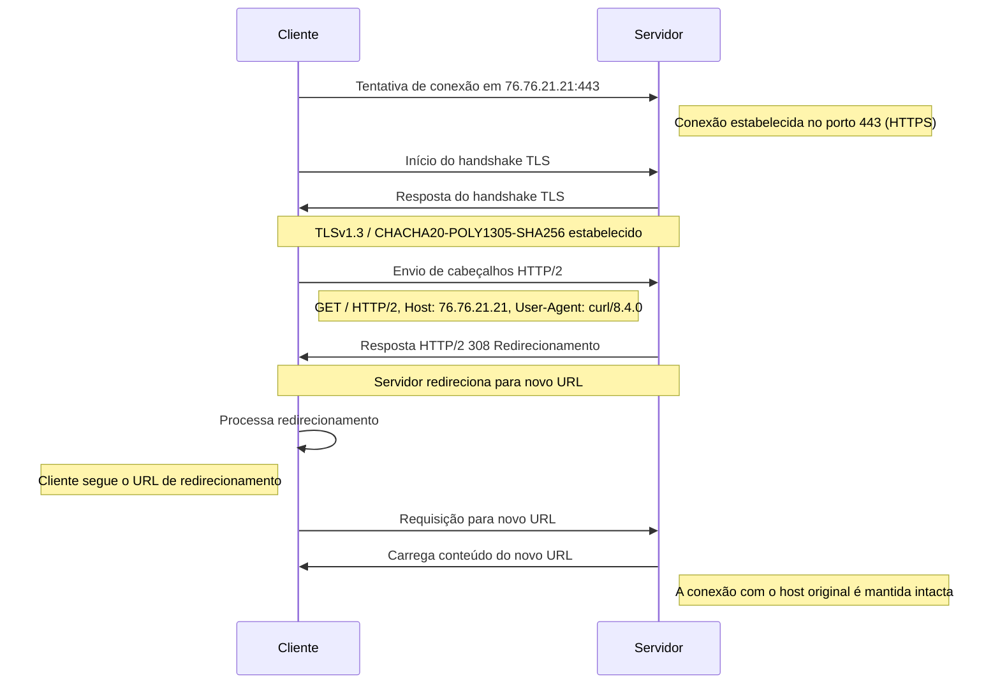

# Dia 16 - Testes Integrados e Crescimento profissional 

## Pista rápida:

O dia 16 reservou-se aos testes integrados junto com algumas sacadas para o crescimento profissional. 
Na aula de abertura o Filipe fala a respeito de testes unitários e como eles não garatem que a integração esteja 
funcionando. A pirâmide de testes é trazida para debates e suscita alguns questionamentos se realmente testes integrados são `caros/difíceis.` O usuário do 𝕏 [@swyx](https://twitter.com/swyx/status/1261202288476971008) traz uma thread com um título bastante ousado a respeito desse questionamento: Test Pyramid has fallen out of style.
Ao final do vídeo o Filipe destaca a importância de como as coisas realmente funcionam e nos motiva a `perder` o vislumbre por tecnologias do hype - no sentido de achar que tudo é mágica - para focarmos realmente no impacto que entregamos ao conhecer bem uma tecnologia e poder decidir melhor.

## Os diferentes tipos de testes:

- Unitários: se formos definir à risca esses tipos de testes se caracterizam por não ter nenhuma dependência com outros tipos componentes do sistema - ou seja, eles são uma unidade de fato. Contudo, para cada sistema podemos definir o que seria uma unidade sem nos restrigirmos à definição literal.

>  (...) posso definir o que é uma unidade no sistema mesmo que essa unidade tenha por baixo integração com outras unidades

- Integração: os testes integrados se caracterizam por conectar unidades do sistema e checar se a junção entre as partes funcionam como esperado. Até o presente momento há um grande debate a respeito dos testes unitários por serem caros e difíceis de serem testados. Há também o fato que no passado era mais devagar executar esses tipos de testes mas isso nos dias atuais é algo altamenta superado. 

- EeE: Esses tipos de testes são os testes que de fato testam o que os clientes usam. Um teste de ponta-a-ponta como o próprio nome sugere testa as extremidades de um sistema para garantir o seu funcionamento.

## Não é magia! (é Protocolo)

> 🤔 Como um mesmo IP pode servir vários sites diferentes?
> De onde o servidor tira a informação de que ora acessa o site A e que ora acessa o site B?

### R: quem diz para onde ser redirecionado é o client no header da requisição:

```bash
curl https://76.76.21.21 --insecure --verbose
```



## Versionamento de API 

A última aula do dia 16 foi reservada para explicar as estrategias de versionamento de APIs:

* URI Path Versioning: /api/v1 
* Header Versioning: X-API-VERSION

Versionar APIs permite-nos garantir compatibilidade sem adicionar breaking changes que podem 
impactar os clientes que utilizam a API.

---
- [Anterior](/curso.dev/dias/dia15.md) - [Próximo](/curso.dev/dias/dia17.md) - [Sumário](../readme.md)
